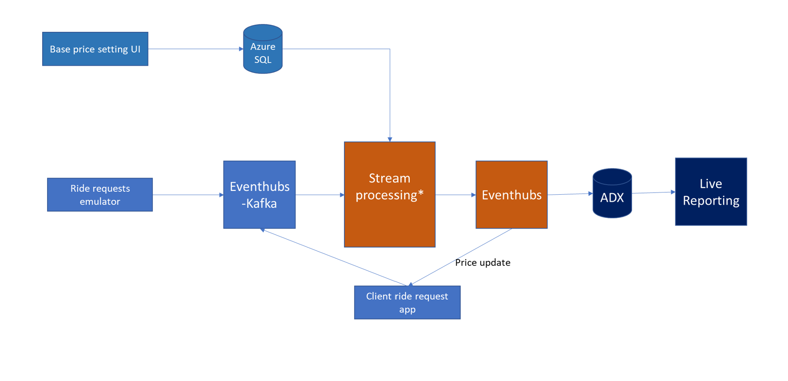

# Overview
This repo provides implementation examples in Azure with both Microsoft and OSS technologies for streaming analytic solution.
It is used as accompanied content for the Develop Streaming Analytics Solution Workshop
### Scenario
Company X is operating a ride hailing service. Customers in an app to order for the ride service. A critical component of the solution is to set an optimal price that maximize profit. The algorithm mainly relies on real time demand and supply data to determine adjustment to current price. 
In this implementation, we simplify the scenario to address following main features:
-	Real time ride requests at various locations are captured and processed
-	For every location, average request volume, average price over the last 5 minutes and base price policy (updated periodically) are inputs to pricing calculation algorithm. New price is recalculated every 20s.
-	A live monitoring dashboard that shows requests volume and average price per location is used for operators
-	A client web app that shows current price when a destination location is selected. It needs to display new price as soon as available so to minimize the risk of having to update the price after customer order to ride. 

The implementations shows case following capabilities:
-	Streaming ingestion from multiple sources including reference data and streaming data sources
-	Parallelism in data ingestion and processing
-	Join datasets
-	State computation (* with custom state computation in Flink and Spark)
-	ML model scoring 
-	Latency difference between Flink, ASA and Spark (real streaming vs. mini-batch)
-	Streaming serving options: Live reporting vs. triggering business workflow
Following is the architecture for the demo implementation. Some components are implemented with a single technology, some are implemented using multiple technologies.

## Contributing

This project welcomes contributions and suggestions.  Most contributions require you to agree to a
Contributor License Agreement (CLA) declaring that you have the right to, and actually do, grant us
the rights to use your contribution. For details, visit https://cla.opensource.microsoft.com.

When you submit a pull request, a CLA bot will automatically determine whether you need to provide
a CLA and decorate the PR appropriately (e.g., status check, comment). Simply follow the instructions
provided by the bot. You will only need to do this once across all repos using our CLA.

This project has adopted the [Microsoft Open Source Code of Conduct](https://opensource.microsoft.com/codeofconduct/).
For more information see the [Code of Conduct FAQ](https://opensource.microsoft.com/codeofconduct/faq/) or
contact [opencode@microsoft.com](mailto:opencode@microsoft.com) with any additional questions or comments.

## Trademarks

This project may contain trademarks or logos for projects, products, or services. Authorized use of Microsoft 
trademarks or logos is subject to and must follow 
[Microsoft's Trademark & Brand Guidelines](https://www.microsoft.com/en-us/legal/intellectualproperty/trademarks/usage/general).
Use of Microsoft trademarks or logos in modified versions of this project must not cause confusion or imply Microsoft sponsorship.
Any use of third-party trademarks or logos are subject to those third-party's policies.
